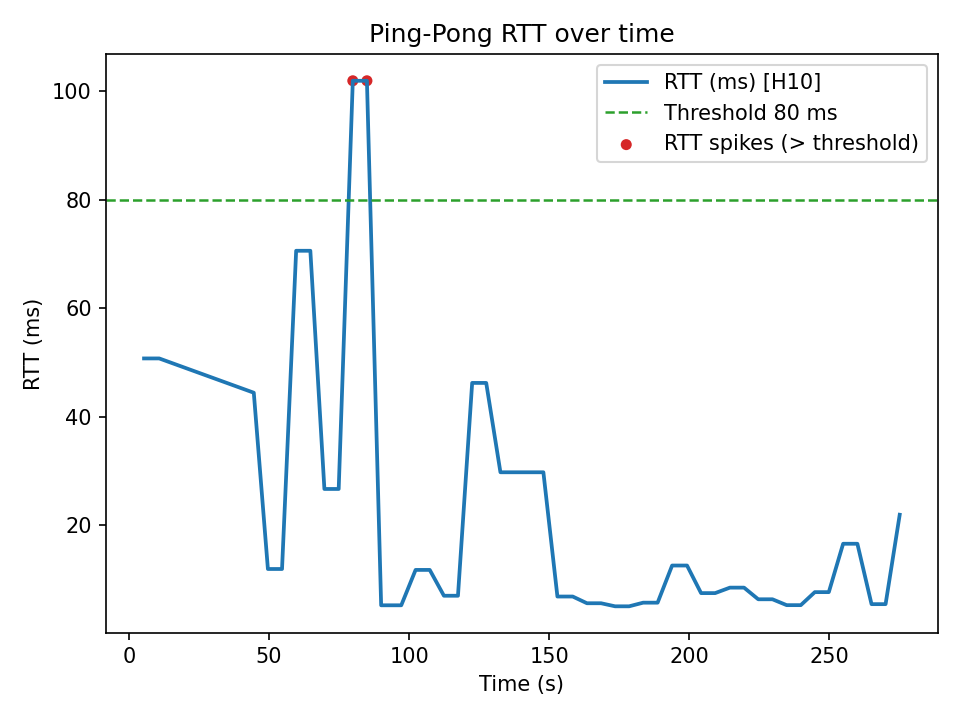
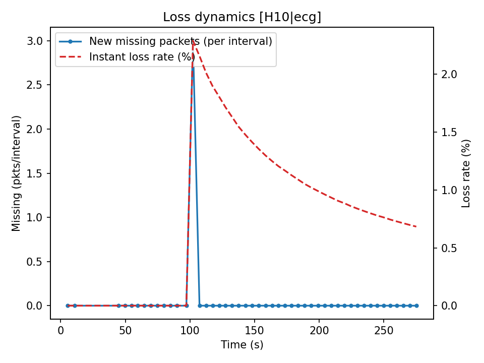
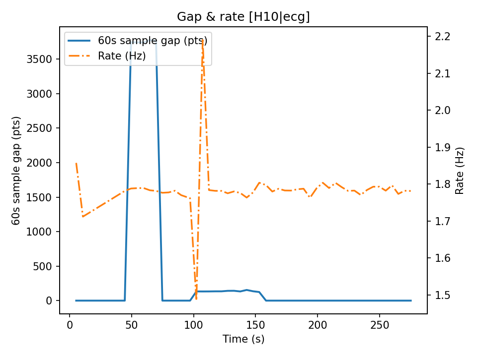

# UDP 传输质量简报

**TL;DR：不通过。存在红色警告，建议靠近路由器、使用 5GHz、并将每包样本数下调 20–30% 后重跑。**

- 会话时长：约 275 秒
- 数据来源：S20250902-221049.metrics.jsonl

## 怎么看这份简报（给非工程专业的研究者）
- **丢包率**：数字越小越好。连续波形（ECG/ACC/PPG）丢包会造成波形缺段；事件（RR/HR/ppi）丢包会漏掉个别事件。
- **到达时间稳定性**：只对连续波形有意义。显示为“稳定/一般/不稳定”，括号里给出技术指标 p95。
- **样本差（60秒）**：理论上 60 秒应收到多少样本，实际到了多少；接近 0 最好。
- **颜色含义**：绿=好（放心用），黄=一般（留意），红=差（建议重跑或剔除受影响片段）。

## 各数据流情况
### H10 | ACC
- 包统计：pkts=621  miss=285  丢包率=31.46%
- 到达时间稳定性：不稳定（p95≈372.3 ms）
- 60秒样本差：最大 1531 点（0 最佳）
- 评价：**红**
- 影响与建议：连续波形缺段或波动明显，建议靠近路由器、使用 5GHz、或减小每包样本数后重跑。

### H10 | ECG
- 包统计：pkts=436  miss=3  丢包率=0.68%
- 到达时间稳定性：不稳定（p95≈136.2 ms）
- 60秒样本差：最大 3776 点（0 最佳）
- 评价：**红**
- 影响与建议：连续波形缺段或波动明显，建议靠近路由器、使用 5GHz、或减小每包样本数后重跑。

### H10 | HR
- 包统计：pkts=243  miss=3  丢包率=1.22%
- 事件频率：约 60 bpm
- 评价：**黄**
- 影响与建议：有少量漏记，建议结合 ECG 重建 RR 或复核关键片段。

### H10 | RR
- 包统计：pkts=296  miss=3  丢包率=1.00%
- 事件频率：约 73 bpm
- 评价：**黄**
- 影响与建议：有少量漏记，建议结合 ECG 重建 RR 或复核关键片段。

## 网络稳定性图表
- RTT 中位数 ≈ 10.1 ms，p95 ≈ 70.6 ms，尖峰(>80ms) 次数：2

### How to read these figures
- **RTT over time**：折线是往返时延（毫秒），虚线是阈值（80 ms），散点是超过阈值的尖峰。尖峰出现的秒数就是“网络打喷嚏”的时段。
- **Loss dynamics**：左轴是每个汇总周期的“新增丢包包数”，右轴是“瞬时丢包率(%)”。若左轴出现连续非零台阶，说明有成段缺口。
- **Gap & rate**：左轴是 60s sample gap（应到样本与实到样本之差），右轴是到达速率 Rate(Hz)。gap 抬高同时速率下降，基本就是链路拥塞或系统停顿。

## 总体结论：**不通过**